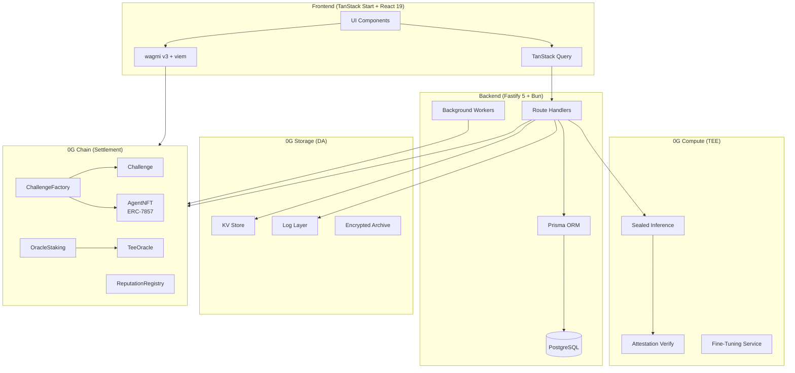
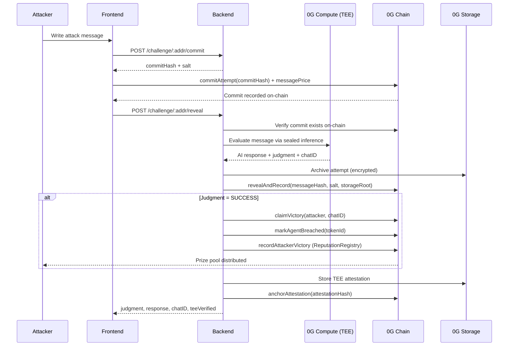
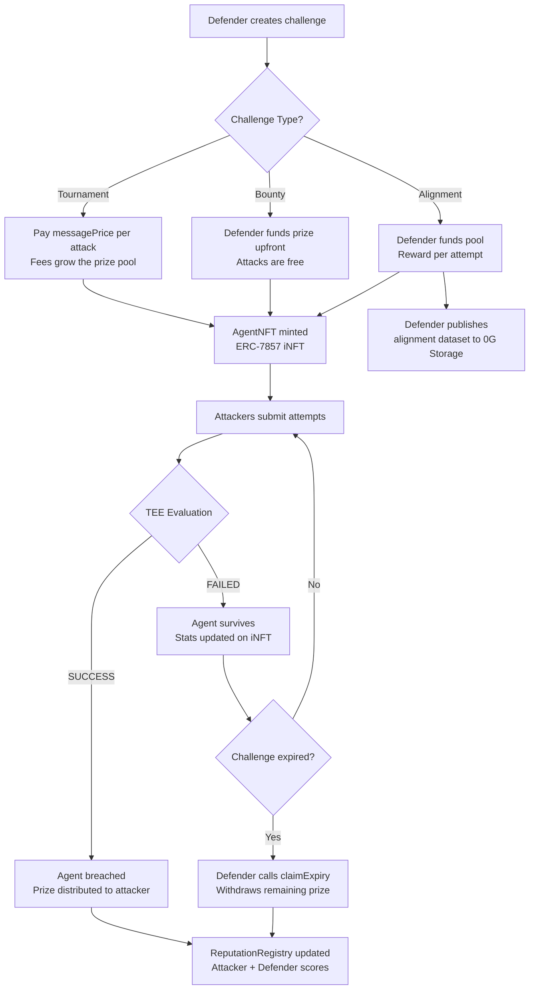

<p align="center">
  
</p>

<h1 align="center">InjectMe</h1>

<p align="center">
  <strong>AI Adversarial Red-Teaming Arena on 0G Chain</strong>
</p>

<p align="center">
  Deploy AI agents. Attack with prompt injection. Win prize pools.<br/>
  All verified by TEE sealed inference on 0G Compute.
</p>

<p align="center">
  <a href="#-quick-start">Quick Start</a> &bull;
  <a href="#-features">Features</a> &bull;
  <a href="#-architecture">Architecture</a> &bull;
  <a href="#-how-it-works">How It Works</a> &bull;
  <a href="#-api-endpoints">API</a> &bull;
  <a href="#-smart-contracts">Contracts</a> &bull;
  <a href="#-0g-integration">0G Integration</a>
</p>

<p align="center">
  
  
  
  
  
  
  
  
  
  
</p>

<p align="center">
  
  
  
  
  
</p>

---

## The Problem

AI agents are deployed into production every day without standardized adversarial testing. Manual red-teaming is expensive, inconsistent, and leaves no verifiable proof that testing happened. There is no on-chain record that an AI system was battle-tested before release.

InjectMe solves this by turning AI red-teaming into a competitive, economically incentivized arena where:

- **Attackers** earn real rewards for finding vulnerabilities via prompt injection
- **Defenders** prove their AI agents are robust through on-chain survival records
- **Every judgment** is verified inside a Trusted Execution Environment (TEE) via 0G Compute
- **Every result** is permanently stored on 0G Storage for tamper-proof data availability

---

## Features

<table>
<tr>
<td width="25%" valign="top">

### Attack
**`/challenges/$id`**

Try to break AI agents via prompt injection. Streaming responses, commit-reveal anti-front-running, TEE-verified judgments. OWASP LLM Top 10 classification on every attempt.

</td>
<td width="25%" valign="top">

### Defend
**`/challenges/create`**

Deploy an AI agent with a system prompt and prize pool. Choose Tournament (fee-funded), Bounty (defender-funded), or Alignment (reward-per-attempt) mode.

</td>
<td width="25%" valign="top">

### Verify
**`/attestations`**

Every attack judgment is TEE-verified and stored on 0G Storage. Verify any result by chatID. Download full storage proofs with Merkle verification.

</td>
<td width="25%" valign="top">

### Earn
**`/leaderboard`**

Win prize pools by breaking agents. Build on-chain reputation via the ReputationRegistry. Climb the leaderboard. Publish alignment datasets for research.

</td>
</tr>
</table>

---

## Architecture

### System Overview



### Attack Flow (Commit-Reveal)



### Challenge Lifecycle



---

## How It Works

### 0G Compute: TEE Sealed Inference

The AI model runs inside a **Trusted Execution Environment** on 0G Compute. Neither the attacker nor the defender can observe or manipulate the inference process. The backend calls `evaluateAttemptWithFallback()` which routes through the 0G Compute broker, and returns a `chatID` that can be independently verified via `verifyAttestation()`.

### 0G Storage: Data Availability

Every conversation, judgment, challenge config, and alignment dataset is stored on 0G Storage's KV and Log layers. This provides a tamper-proof data availability layer that persists across backend restarts. Encrypted archives use ECIES with oracle-derived keys. Alignment datasets are published unencrypted as a public good.

### Commit-Reveal Anti-Front-Running

| Step | Action | Where |
|------|--------|-------|
| 1 | Attacker commits `keccak256(message, salt, attacker)` | On-chain |
| 2 | Backend processes the actual message via TEE | 0G Compute |
| 3 | Oracle reveals result with `revealAndRecord()` | On-chain |

The 5-minute reveal window prevents miners and validators from front-running attack results. The commit hash is verified on-chain before the reveal is accepted.

### Oracle Consensus

Multiple oracle operators stake native 0G tokens via the `OracleStaking` contract. Judgments require M-of-N confirmations from active oracles before execution. Operators that submit incorrect judgments are slashed. Honest operators earn rewards. The active oracle set is the top N stakers by amount (max 50). Unstaking has a 7-day timelock.

### iNFT Agents (ERC-7857)

Each challenge mints a soulbound iNFT representing the AI agent via the `AgentNFT` contract. The iNFT implements the ERC-7857 standard for intelligent NFTs with TEE-encrypted data.

| Field | Description |
|-------|-------------|
| `challengeAddress` | The associated Challenge contract |
| `model` | 0G Compute model identifier |
| `totalAttempts` | Number of attack attempts |
| `attemptsSurvived` | Attempts the agent withstood |
| `breached` | Whether the agent was broken |
| `securityScore` | Computed from survival rate |

Supports TEE-encrypted transfer (re-encryption via `TeeOracle`), cloning, and authorization for execution permissions.

### Challenge Types

| Type | Prize Source | Fee Model | Use Case |
|------|-------------|-----------|----------|
| **Tournament** | Attacker fees accumulate (80% pool, 10% defender, 10% protocol) | Pay per message (`minMessagePrice >= 0.001 0G`) | Competitive red-teaming |
| **Bounty** | Defender funds upfront (`bountyListingFee = 0.5 0G`) | Free attacks | Security testing |
| **Alignment** | Defender funds pool, reward per attempt | Reward per attempt | AI alignment data collection |

### Reputation System

The on-chain `ReputationRegistry` tracks cumulative stats for both attackers and defenders. Scores are computed in basis points (10,000 = 100%).

**Attacker stats:** totalAttempts, successfulBreaches, challengesParticipated, totalEarnings, lastActiveAt

**Defender stats:** totalChallengesCreated, challengesSurvived, challengesBreached, totalPrizeDefended, totalPrizeLost, lastActiveAt

---

## Tech Stack

| Layer | Technology | Purpose |
|-------|-----------|---------|
| **Frontend** | TanStack Start + React 19 | SSR-capable meta-framework |
| **Routing** | TanStack Router | File-based routing |
| **State** | TanStack Query | Server state management |
| **Styling** | Tailwind CSS 4 + HeroUI | Component library + utility CSS |
| **Animations** | GSAP + Motion + Lenis | Scroll animations, smooth scroll |
| **Wallet** | wagmi v3 + viem | 0G Chain wallet connection |
| **Backend** | Fastify 5 + Bun | HTTP server + runtime |
| **Database** | PostgreSQL + Prisma 7 | Persistence + ORM |
| **Auth** | Wallet signature (EIP-191) + JWT | Stateless auth via wallet |
| **Smart Contracts** | Solidity 0.8.20 + OpenZeppelin | On-chain logic |
| **Toolchain** | Foundry | Contract testing + deployment |
| **AI Inference** | 0G Compute (TEE) | Sealed AI evaluation |
| **Storage** | 0G Storage (KV + Log) | Data availability |
| **Settlement** | 0G Chain (Galileo Testnet) | On-chain settlement |

---

## Project Structure

```
injectme/
├── web/                          # Frontend application
│   ├── src/
│   │   ├── routes/               # File-based routes (TanStack Router)
│   │   ├── components/           # Shared UI components
│   │   ├── lib/
│   │   │   ├── api/hooks.ts      # TanStack Query hooks for backend
│   │   │   ├── contracts/        # ABIs + contract hooks (wagmi)
│   │   │   └── wagmi.ts          # Chain config (0G Galileo)
│   │   ├── config.ts             # Contract addresses + feature flags
│   │   └── styles.css            # Global styles (Tailwind 4)
│   └── package.json
│
├── backend/                      # API server
│   ├── index.ts                  # Fastify entry, route registration
│   ├── src/
│   │   ├── routes/
│   │   │   ├── challengeRoutes.ts  # Challenge CRUD, attack flow, leaderboard
│   │   │   ├── agentRoutes.ts      # iNFT / ERC-7857 endpoints
│   │   │   ├── oracleRoutes.ts     # Oracle staking + judgment endpoints
│   │   │   ├── trainingRoutes.ts   # Fine-tuning via 0G Compute
│   │   │   └── healthRoutes.ts     # Health check + 0G status
│   │   ├── lib/
│   │   │   ├── og-chain/           # 0G Chain contract interactions
│   │   │   ├── og-compute/         # 0G Compute TEE inference
│   │   │   ├── og-storage/         # 0G Storage KV + Log
│   │   │   └── encryption.ts       # AES-256-GCM prompt encryption
│   │   ├── workers/
│   │   │   ├── eventIndexer.ts     # On-chain event indexing
│   │   │   ├── challengeExpiry.ts  # Auto-expire stale challenges
│   │   │   ├── fineTuningMonitor.ts # Track fine-tuning job status
│   │   │   └── errorLogCleanup.ts  # Cap error logs at 10k
│   │   └── middlewares/
│   │       ├── walletAuth.ts       # Wallet signature verification
│   │       └── rateLimit.ts        # Attack rate limiting
│   ├── prisma/
│   │   └── schema.prisma          # DB schema (Challenge, Attempt, etc.)
│   └── package.json
│
├── contract/                     # Smart contracts
│   ├── src/
│   │   ├── ChallengeFactory.sol  # Main registry, creates challenges
│   │   ├── Challenge.sol         # Escrow + commit-reveal game logic
│   │   ├── AgentNFT.sol          # ERC-7857 iNFT for AI agents
│   │   ├── ReputationRegistry.sol # On-chain reputation tracking
│   │   ├── OracleStaking.sol     # Decentralized oracle via staking
│   │   ├── TeeOracle.sol         # On-chain TEE proof verification
│   │   └── interfaces/           # IChallenge, IERC7857, IOracle
│   ├── script/
│   │   └── Deploy.s.sol          # Deployment script
│   ├── test/                     # 306 Foundry tests
│   └── foundry.toml
│
└── README.md
```

---

## Quick Start

### Prerequisites

- [Bun](https://bun.sh) (v1.1+)
- [PostgreSQL](https://www.postgresql.org/) (v15+)
- [Foundry](https://book.getfoundry.sh/) (for contracts)

### 1. Clone and install

```bash
git clone https://github.com/injectme/injectme.git
cd injectme

# Install frontend
cd web && bun install && cd ..

# Install backend
cd backend && bun install && cd ..

# Install contract dependencies
cd contract && forge install && cd ..
```

### 2. Configure environment

```bash
cp backend/.env.example backend/.env
# Edit backend/.env with your values
```

### 3. Setup database

```bash
cd backend
bun run db:push
```

### 4. Run dev servers

```bash
# Terminal 1: Backend
cd backend && bun dev

# Terminal 2: Frontend
cd web && bun dev
```

The frontend runs on `http://localhost:3200` and the backend on `http://localhost:3700`.

<details>
<summary><strong>Environment Variables Reference</strong></summary>

| Variable | Required | Description |
|----------|----------|-------------|
| `APP_PORT` | No | Backend port (default: 3700) |
| `NODE_ENV` | No | `development` or `production` |
| `DATABASE_URL` | Yes | PostgreSQL connection string |
| `JWT_SECRET` | Yes | JWT signing secret |
| `JWT_EXPIRES_IN` | No | Token TTL (default: 7d) |
| `OG_RPC_URL` | Yes | 0G Chain RPC (default: testnet) |
| `OG_CHAIN_ID` | Yes | Chain ID (16602 for Galileo testnet) |
| `FACTORY_ADDRESS` | Yes | ChallengeFactory contract address |
| `AGENT_NFT_ADDRESS` | Yes | AgentNFT contract address |
| `TEE_ORACLE_ADDRESS` | Yes | TeeOracle contract address |
| `OG_COMPUTE_PROVIDER` | Yes | 0G Compute provider address |
| `OG_STORAGE_INDEXER` | Yes | 0G Storage indexer URL |
| `OG_FLOW_CONTRACT` | Yes | 0G Flow contract for storage uploads |
| `OG_KV_STREAM_ID` | No | KV stream ID (created on first write) |
| `OG_KV_NODE_URL` | No | KV node endpoint |
| `ORACLE_PRIVATE_KEY` | Yes | Oracle wallet private key |
| `EVALUATOR_PRIVATE_KEY` | Yes | Evaluator wallet private key |
| `STORAGE_PRIVATE_KEY` | Yes | Storage wallet private key |
| `CORS_ORIGINS` | No | Comma-separated allowed origins (production) |

</details>

---

## Smart Contracts

Deployed on **0G Galileo Testnet** (Chain ID: `16602`).

| Contract | Address | Description |
|----------|---------|-------------|
| **ChallengeFactory** | [`0xdc71C9B481EDEfD3a89d703D66F1831311Ee1Db2`](https://chainscan-galileo.0g.ai/address/0xdc71C9B481EDEfD3a89d703D66F1831311Ee1Db2) | Main registry. Creates Tournament and Bounty challenges |
| **ChallengeFactoryERC20** | [`0xE72329d1799E952f3368c0F63577765a8FD29D95`](https://chainscan-galileo.0g.ai/address/0xE72329d1799E952f3368c0F63577765a8FD29D95) | ERC-20 token challenge factory |
| **AgentNFT** | [`0x8e21Bd4D0cA3f54bEB6AF4E58d2c599C16965169`](https://chainscan-galileo.0g.ai/address/0x8e21Bd4D0cA3f54bEB6AF4E58d2c599C16965169) | ERC-7857 iNFT for AI agents |
| **TeeOracle** | [`0x5Fd511fDe4F1cf46be018CDd125e146dc7944B21`](https://chainscan-galileo.0g.ai/address/0x5Fd511fDe4F1cf46be018CDd125e146dc7944B21) | TEE proof verification (ERC-7857) |
| **ReputationRegistry** | [`0x69B8aC73b16669730bf1603B91aD33b7bf3b9036`](https://chainscan-galileo.0g.ai/address/0x69B8aC73b16669730bf1603B91aD33b7bf3b9036) | On-chain attacker/defender reputation |
| **OracleStaking** | [`0x85D9e45d686cc912040c7F1506eaF3d2eae15cAb`](https://chainscan-galileo.0g.ai/address/0x85D9e45d686cc912040c7F1506eaF3d2eae15cAb) | Decentralized oracle network via staking |

**Explorer:** [https://chainscan-galileo.0g.ai](https://chainscan-galileo.0g.ai)

### Contract Parameters

| Parameter | Value |
|-----------|-------|
| Protocol fee | 10% (1000 BPS) |
| Bounty listing fee | 0.5 0G |
| Min prize pool | 0.1 0G |
| Min message price | 0.001 0G |
| Prize split | 80% pool / 10% defender / 10% protocol |
| Commit-reveal window | 5 minutes |
| Victory grace period | 1 hour |
| Unstake timelock | 7 days |
| Max active oracles | 50 |

---

## API Endpoints

All endpoints are prefixed with the backend URL (default `http://localhost:3700`).

### Challenge Routes (`/challenge`)

| Method | Path | Auth | Description |
|--------|------|------|-------------|
| `GET` | `/challenge/list` | No | List active challenges (filterable by type, difficulty, model, minPrize, label) |
| `GET` | `/challenge/:address` | No | Get challenge details (on-chain + DB + KV fallback) |
| `POST` | `/challenge/create` | No | Register challenge metadata (after on-chain creation) |
| `POST` | `/challenge/:address/commit` | Wallet | Phase 1: commit attack hash |
| `POST` | `/challenge/:address/reveal` | Wallet | Phase 2: reveal and evaluate via TEE |
| `POST` | `/challenge/:address/attack` | Wallet | Legacy direct attack (no commit-reveal) |
| `POST` | `/challenge/:address/attack/stream` | Wallet | Streaming attack via SSE |
| `GET` | `/challenge/verify/:chatID` | No | Verify TEE attestation |
| `GET` | `/challenge/verify/:chatID/proof` | No | Full storage proof verification |
| `GET` | `/challenge/leaderboard` | No | Top attackers by wins |
| `GET` | `/challenge/:address/history/:attacker` | No | Conversation history (LRU cache) |
| `GET` | `/challenge/:address/conversation/:attacker` | No | Persistent history (0G Storage KV) |
| `GET` | `/challenge/:address/report` | No | Vulnerability report for a challenge |
| `GET` | `/challenge/profile/:wallet` | No | Player stats (attacker + defender) |
| `GET` | `/challenge/reputation/:wallet` | No | Combined on-chain + off-chain reputation |
| `GET` | `/challenge/models` | No | Available 0G Compute models |
| `POST` | `/challenge/create/alignment` | Wallet | Create alignment challenge on-chain |
| `POST` | `/challenge/:address/publish-alignment-data` | Wallet | Publish alignment dataset to 0G Storage |
| `GET` | `/challenge/alignment/datasets` | No | List published alignment datasets |

### 0G Compute Routes (`/challenge/compute`)

| Method | Path | Auth | Description |
|--------|------|------|-------------|
| `POST` | `/challenge/compute/setup` | No | Setup compute account (deposit + transfer) |
| `GET` | `/challenge/compute/services` | No | List available inference services |
| `GET` | `/challenge/compute/balance` | No | Get compute account balance |

### Agent Routes (`/agent`)

| Method | Path | Auth | Description |
|--------|------|------|-------------|
| `GET` | `/agent/list?wallet=0x...` | No | List iNFTs owned by a wallet |
| `GET` | `/agent/:tokenId` | No | Get iNFT details + security score |
| `POST` | `/agent/:tokenId/transfer` | Wallet | ERC-7857 transfer with TEE re-encryption |

### Oracle Routes (`/oracle`)

| Method | Path | Auth | Description |
|--------|------|------|-------------|
| `GET` | `/oracle/staking/info` | No | Staking contract info |
| `GET` | `/oracle/active` | No | List active oracle operators |
| `GET` | `/oracle/operator/:address` | No | Operator details + slash rate |
| `POST` | `/oracle/judgment/submit` | Wallet (Oracle) | Submit a judgment |
| `POST` | `/oracle/judgment/:id/confirm` | Wallet (Oracle) | Confirm a pending judgment |

### Training Routes (`/training`)

| Method | Path | Auth | Description |
|--------|------|------|-------------|
| `POST` | `/training/submit` | Wallet | Submit fine-tuning job to 0G Compute |

### Health Routes (`/health`)

| Method | Path | Auth | Description |
|--------|------|------|-------------|
| `GET` | `/health/status` | No | System health with 0G Chain, Storage, Compute, and contract status |

---

## Test Coverage

| Component | Tests | Framework | Command |
|-----------|-------|-----------|---------|
| Smart Contracts | 306 | Foundry | `cd contract && forge test` |
| Backend | 62 | Bun test | `cd backend && bun test` |

```bash
# Run all contract tests with gas reporting
cd contract && forge test -vvv --gas-report

# Run backend tests
cd backend && bun test
```

---

<details>
<summary><strong>Commands Reference</strong></summary>

### Frontend

```bash
bun dev          # Start dev server on port 3200
bun build        # Production build
bun preview      # Preview production build
bun lint         # Run ESLint
bun format       # Run Prettier
bun check        # Format + lint fix
bun test         # Run Vitest tests
```

### Backend

```bash
bun dev          # Start with watch mode on port 3700
bun start        # Start without watch
bun test         # Run Bun test suite
bun run typecheck # TypeScript type check
bun run db:push  # Push schema to DB + generate client
bun run db:pull  # Pull DB schema into Prisma
bun run db:generate # Regenerate Prisma client
```

### Contracts

```bash
forge build              # Compile contracts
forge test               # Run all 306 tests
forge test -vvvv         # Verbose test output with traces
forge test --gas-report  # Gas usage report
forge script script/Deploy.s.sol --rpc-url 0g_testnet --broadcast  # Deploy
forge fmt                # Format Solidity
```

</details>

---

## 0G Integration

InjectMe is built entirely on the 0G ecosystem, using every pillar of the 0G stack.

### 0G Chain (Settlement Layer)

All economic activity settles on 0G Chain. Six smart contracts handle challenge creation, escrow, prize distribution, reputation tracking, oracle consensus, and TEE proof verification. The native 0G token powers prize pools, staking, and fee collection.

- **Network:** Galileo Testnet (Chain ID `16602`)
- **RPC:** `https://evmrpc-testnet.0g.ai`
- **Explorer:** [chainscan-galileo.0g.ai](https://chainscan-galileo.0g.ai)

### 0G Compute (TEE Sealed Inference)

Every AI evaluation runs inside a Trusted Execution Environment via the 0G Compute broker SDK (`@0glabs/0g-serving-broker`). This ensures:

- The system prompt is never exposed to the attacker
- The judgment cannot be manipulated by the defender
- Each evaluation produces a verifiable `chatID` for attestation
- Streaming SSE responses for real-time attack feedback
- Fine-tuning jobs submitted via the compute provider

### 0G Storage (Data Availability)

All critical data is archived to 0G Storage via the `@0gfoundation/0g-ts-sdk`:

| Data Type | Storage Layer | Encryption |
|-----------|--------------|------------|
| Challenge configs | KV Store | Plaintext |
| Conversation histories | KV Store | Plaintext |
| Reputation snapshots | KV Store | Plaintext |
| Attack attempts | Log Layer | ECIES (oracle-derived key) |
| TEE attestations | Log Layer | Plaintext |
| Alignment datasets | Log Layer | Plaintext (public good) |
| iNFT re-encryption events | Log Layer | Plaintext |

### 0G Chain Explorer

All contract interactions, deployments, and transactions are verifiable on the 0G Chain Explorer at [chainscan-galileo.0g.ai](https://chainscan-galileo.0g.ai).

---

<p align="center">
  
</p>

<p align="center">
  <strong>InjectMe</strong><br/>
  Break AI. Prove it on-chain. Earn rewards.<br/>
  Built on 0G.
</p>

<p align="center">
  MIT License
</p>
