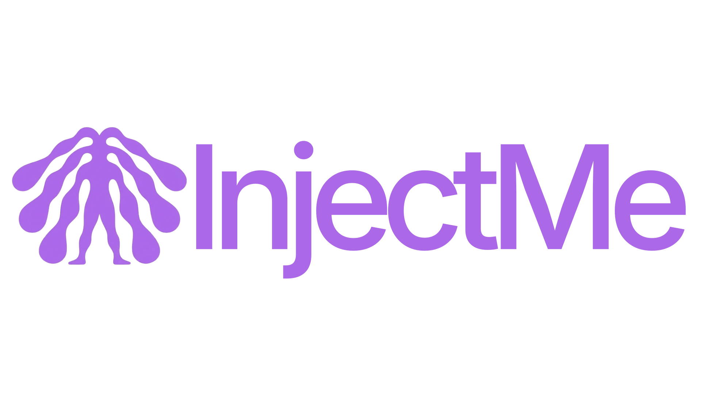
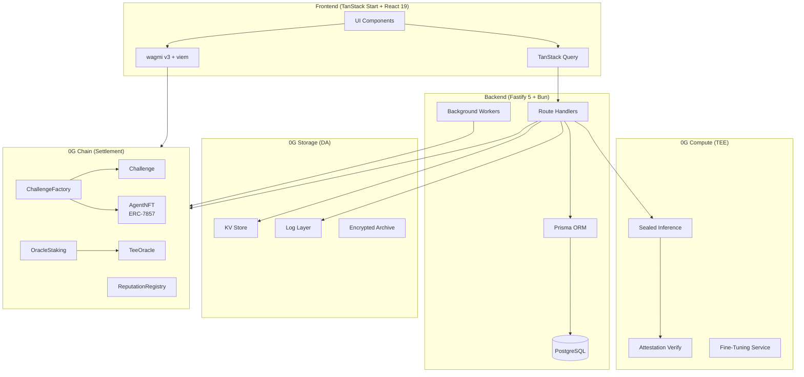
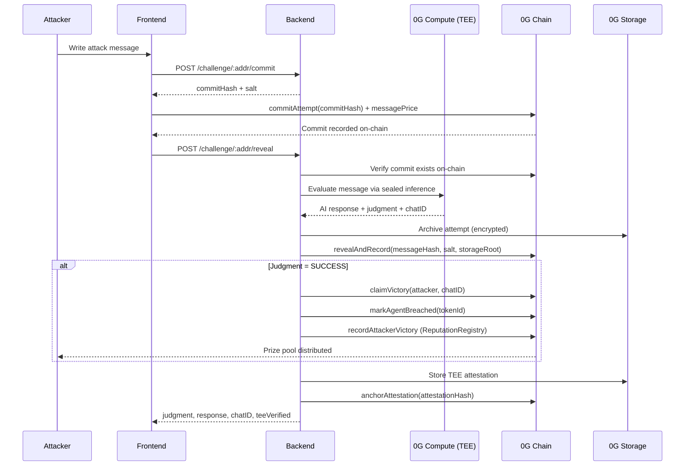
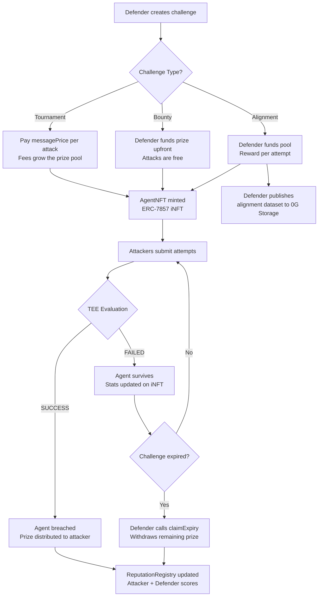

<p align="center">
  
</p>

<h1 align="center">InjectMe</h1>

<p align="center">
  <strong>AI Adversarial Red-Teaming Arena on 0G Chain</strong>
</p>

<p align="center">
  Deploy AI agents. Attack with prompt injection. Win prize pools.<br/>
  All verified by TEE sealed inference on 0G Compute.
</p>

<p align="center">
  <a href="#the-problem">Problem</a> &bull;
  <a href="#features">Features</a> &bull;
  <a href="#0g-features">0G Features</a> &bull;
  <a href="#architecture">Architecture</a> &bull;
  <a href="#how-it-works">How It Works</a> &bull;
  <a href="#smart-contracts">Contracts</a> &bull;
  <a href="#api-endpoints">API</a> &bull;
  <a href="#quick-start">Quick Start</a>
</p>

<p align="center">
  
  
  
  
  
  
  
  
  
  
</p>

<p align="center">
  
  
  
  
  
</p>

---

## The Problem

AI agents are deployed into production every day without standardized adversarial testing. Manual red-teaming is expensive, inconsistent, and leaves no verifiable proof that testing happened. There is no on-chain record that an AI system was battle-tested before release.

InjectMe solves this by turning AI red-teaming into a competitive, economically incentivized arena where:

- **Attackers** earn real rewards for finding vulnerabilities via prompt injection
- **Defenders** prove their AI agents are robust through on-chain survival records
- **Every judgment** is verified inside a Trusted Execution Environment (TEE) via 0G Compute
- **Every result** is permanently stored on 0G Storage for tamper-proof data availability

---

## Features

<table>
<tr>
<td width="25%" valign="top">

### Attack
**`/challenges/$id`**

Try to break AI agents via prompt injection. Streaming responses, commit-reveal anti-front-running, TEE-verified judgments. OWASP LLM Top 10 classification on every attempt.

</td>
<td width="25%" valign="top">

### Defend
**`/challenges/create`**

Deploy an AI agent with a system prompt and prize pool. Choose Tournament (fee-funded), Bounty (defender-funded), or Alignment (reward-per-attempt) mode.

</td>
<td width="25%" valign="top">

### Verify
**`/attestations`**

Every attack judgment is TEE-verified and stored on 0G Storage. Verify any result by chatID. Download full storage proofs with Merkle verification.

</td>
<td width="25%" valign="top">

### Earn
**`/leaderboard`**

Win prize pools by breaking agents. Build on-chain reputation via the ReputationRegistry. Climb the leaderboard. Publish alignment datasets for research.

</td>
</tr>
</table>

---

## 0G Features

InjectMe is built entirely on the 0G ecosystem, utilizing every pillar of the 0G stack for a fully decentralized AI testing platform.

### 0G Chain (Settlement Layer)

All economic activity settles on 0G Mainnet (Aristotle). Six smart contracts handle challenge creation, escrow, prize distribution, reputation tracking, oracle consensus, and TEE proof verification. The native 0G token powers prize pools, staking, and fee collection.

| Property | Value |
|----------|-------|
| Network | 0G Mainnet (Aristotle) |
| Chain ID | `16661` |
| RPC | `https://evmrpc.0g.ai` |
| Explorer | [chainscan.0g.ai](https://chainscan.0g.ai) |
| Contracts | 6 deployed (Factory, AgentNFT, TeeOracle, Reputation, Staking, ERC20Factory) |

**What we use it for:**
- Challenge creation and prize pool escrow
- Commit-reveal attack scheme (anti-front-running)
- Prize distribution (80% winner / 10% defender / 10% protocol)
- Oracle staking and consensus (M-of-N confirmations)
- TEE attestation anchoring
- Reputation scoring for attackers and defenders
- ERC-7857 iNFT minting for AI agents

### 0G Compute (TEE Sealed Inference)

Every AI evaluation runs inside a Trusted Execution Environment via the 0G Compute broker SDK (`@0glabs/0g-serving-broker`). The TEE guarantees that neither attackers nor defenders can observe or manipulate the inference process.

| Property | Value |
|----------|-------|
| Router | `https://router-api.0g.ai/v1` |
| SDK | `@0glabs/0g-serving-broker` |
| Attestation | Hardware-level TEE proofs |
| Models | Multiple LLMs available via broker |

**What we use it for:**
- Sealed AI inference for attack evaluation (system prompt never exposed)
- Tamper-proof judgment generation (neither party can manipulate results)
- Verifiable `chatID` attestation for every evaluation
- Streaming SSE responses for real-time attack feedback
- Fine-tuning job submission via compute provider
- Model selection from available 0G Compute services

### 0G Storage (Data Availability)

All critical data is archived to 0G Storage via the `@0gfoundation/0g-ts-sdk`. This provides a tamper-proof data availability layer with permanent, verifiable storage backed by Merkle proofs.

| Property | Value |
|----------|-------|
| Indexer | `https://indexer-storage-turbo.0g.ai` |
| Flow Contract | `0x62D4144dB0F0a6fBBaeb6296c785C71B3D57C526` |
| SDK | `@0gfoundation/0g-ts-sdk` |
| Encryption | ECIES with oracle-derived keys |

**What we use it for:**

| Data Type | Storage Layer | Encryption | Purpose |
|-----------|--------------|------------|---------|
| Challenge configs | KV Store | Plaintext | Persistent challenge metadata |
| Conversation histories | KV Store | Plaintext | Attack history across sessions |
| Reputation snapshots | KV Store | Plaintext | Off-chain reputation cache |
| Attack attempts | Log Layer | ECIES (oracle key) | Tamper-proof attempt archive |
| TEE attestations | Log Layer | Plaintext | Verifiable judgment proofs |
| Alignment datasets | Log Layer | Plaintext | Public good for AI safety research |
| iNFT re-encryption events | Log Layer | Plaintext | Transfer audit trail |

### ERC-7857 iNFT (Intelligent NFTs)

Each challenge mints an ERC-7857 iNFT representing the AI agent. This standard enables NFTs with encrypted, TEE-protected data that can be securely transferred between owners.

| Property | Value |
|----------|-------|
| Standard | ERC-7857 |
| Contract | AgentNFT |
| Oracle | TeeOracle (TEE re-encryption) |
| Encryption | AES-256-GCM + TEE key management |

**What we use it for:**
- AI agents as on-chain transferable assets
- Encrypted system prompt storage (only owner can read)
- TEE re-encryption on transfer (new owner gets access, old owner loses it)
- Clone with re-encryption (duplicate agent with same prompt)
- Authorize/revoke read access to encrypted model data
- Security score tracking (attempts survived, breach status)
- Agent marketplace potential (trade battle-tested defenders)

### Oracle Staking (Decentralized Consensus)

Multiple oracle operators stake native 0G tokens to participate in judgment validation. This creates economic incentives for honest behavior and penalizes incorrect judgments.

| Property | Value |
|----------|-------|
| Min Stake | 1,000 0G |
| Confirmations Required | 3 |
| Max Active Oracles | 50 |
| Unstake Timelock | 7 days |
| Slash Mechanism | Incorrect judgments |

**What we use it for:**
- Decentralized oracle network for attack judgments
- M-of-N confirmation before prize distribution
- Slashing for dishonest or incorrect evaluations
- Reward distribution for honest oracle operators
- Active set selection based on stake amount

---

## Architecture

### System Overview



### Attack Flow (Commit-Reveal)



### Challenge Lifecycle



---

## How It Works

### TEE Sealed Inference

The AI model runs inside a **Trusted Execution Environment** on 0G Compute. Neither the attacker nor the defender can observe or manipulate the inference process. The backend calls `evaluateAttemptWithFallback()` which routes through the 0G Compute broker, and returns a `chatID` that can be independently verified via `verifyAttestation()`.

### Commit-Reveal Anti-Front-Running

| Step | Action | Where |
|------|--------|-------|
| 1 | Attacker commits `keccak256(message, salt, attacker)` | On-chain |
| 2 | Backend processes the actual message via TEE | 0G Compute |
| 3 | Oracle reveals result with `revealAndRecord()` | On-chain |

The 5-minute reveal window prevents miners and validators from front-running attack results. The commit hash is verified on-chain before the reveal is accepted.

### Challenge Types

| Type | Prize Source | Fee Model | Use Case |
|------|-------------|-----------|----------|
| **Tournament** | Attacker fees accumulate (80% pool, 10% defender, 10% protocol) | Pay per message (`minMessagePrice >= 0.001 0G`) | Competitive red-teaming |
| **Bounty** | Defender funds upfront (`bountyListingFee = 0.5 0G`) | Free attacks | Security testing |
| **Alignment** | Defender funds pool, reward per attempt | Reward per attempt | AI alignment data collection |

### Reputation System

The on-chain `ReputationRegistry` tracks cumulative stats for both attackers and defenders. Scores are computed in basis points (10,000 = 100%).

**Attacker stats:** totalAttempts, successfulBreaches, challengesParticipated, totalEarnings, lastActiveAt

**Defender stats:** totalChallengesCreated, challengesSurvived, challengesBreached, totalPrizeDefended, totalPrizeLost, lastActiveAt

---

## Smart Contracts

Deployed on **0G Mainnet (Aristotle)** (Chain ID: `16661`).

| Contract | Address | Description |
|----------|---------|-------------|
| **ChallengeFactory** | [`0x8B16b1AF11B8b927290c6C69a24ed12002030eF0`](https://chainscan.0g.ai/address/0x8B16b1AF11B8b927290c6C69a24ed12002030eF0) | Main registry. Creates Tournament and Bounty challenges |
| **ChallengeFactoryERC20** | [`0x3a725eA9c69094550F6Df4C897400B9379d0aD83`](https://chainscan.0g.ai/address/0x3a725eA9c69094550F6Df4C897400B9379d0aD83) | ERC-20 token challenge factory |
| **AgentNFT** | [`0x535e47b2D4409Cab1AB1325BC6fC4C9F9ef106C1`](https://chainscan.0g.ai/address/0x535e47b2D4409Cab1AB1325BC6fC4C9F9ef106C1) | ERC-7857 iNFT for AI agents |
| **TeeOracle** | [`0xD1F2FA31E221EBeF13Fac259123aCd7B79C23018`](https://chainscan.0g.ai/address/0xD1F2FA31E221EBeF13Fac259123aCd7B79C23018) | TEE proof verification (ERC-7857) |
| **ReputationRegistry** | [`0x1c6838de56aDe21a8eEcd125b273F8cBF17f881f`](https://chainscan.0g.ai/address/0x1c6838de56aDe21a8eEcd125b273F8cBF17f881f) | On-chain attacker/defender reputation |
| **OracleStaking** | [`0x064378fdC30bF7f9A9B79D6f70e889384545b7A9`](https://chainscan.0g.ai/address/0x064378fdC30bF7f9A9B79D6f70e889384545b7A9) | Decentralized oracle network via staking |

**Explorer:** [https://chainscan.0g.ai](https://chainscan.0g.ai)

### Contract Parameters

| Parameter | Value |
|-----------|-------|
| Protocol fee | 10% (1000 BPS) |
| Bounty listing fee | 0.5 0G |
| Min prize pool | 0.1 0G |
| Min message price | 0.001 0G |
| Prize split | 80% pool / 10% defender / 10% protocol |
| Commit-reveal window | 5 minutes |
| Victory grace period | 1 hour |
| Unstake timelock | 7 days |
| Max active oracles | 50 |

---

## API Endpoints

All endpoints are prefixed with the backend URL (default `http://localhost:3700`).

### Challenge Routes (`/challenge`)

| Method | Path | Auth | Description |
|--------|------|------|-------------|
| `GET` | `/challenge/list` | No | List active challenges (filterable by type, difficulty, model, minPrize, label) |
| `GET` | `/challenge/:address` | No | Get challenge details (on-chain + DB + KV fallback) |
| `POST` | `/challenge/create` | No | Register challenge metadata (after on-chain creation) |
| `POST` | `/challenge/:address/commit` | Wallet | Phase 1: commit attack hash |
| `POST` | `/challenge/:address/reveal` | Wallet | Phase 2: reveal and evaluate via TEE |
| `POST` | `/challenge/:address/attack` | Wallet | Legacy direct attack (no commit-reveal) |
| `POST` | `/challenge/:address/attack/stream` | Wallet | Streaming attack via SSE |
| `GET` | `/challenge/verify/:chatID` | No | Verify TEE attestation |
| `GET` | `/challenge/verify/:chatID/proof` | No | Full storage proof verification |
| `GET` | `/challenge/leaderboard` | No | Top attackers by wins |
| `GET` | `/challenge/:address/history/:attacker` | No | Conversation history (LRU cache) |
| `GET` | `/challenge/:address/conversation/:attacker` | No | Persistent history (0G Storage KV) |
| `GET` | `/challenge/:address/report` | No | Vulnerability report for a challenge |
| `GET` | `/challenge/profile/:wallet` | No | Player stats (attacker + defender) |
| `GET` | `/challenge/reputation/:wallet` | No | Combined on-chain + off-chain reputation |
| `GET` | `/challenge/models` | No | Available 0G Compute models |
| `POST` | `/challenge/create/alignment` | Wallet | Create alignment challenge on-chain |
| `POST` | `/challenge/:address/publish-alignment-data` | Wallet | Publish alignment dataset to 0G Storage |
| `GET` | `/challenge/alignment/datasets` | No | List published alignment datasets |

### Agent Routes (`/agent`)

| Method | Path | Auth | Description |
|--------|------|------|-------------|
| `GET` | `/agent/list?wallet=0x...` | No | List iNFTs owned by a wallet |
| `GET` | `/agent/:tokenId` | No | Get iNFT details + security score |
| `POST` | `/agent/:tokenId/transfer` | Wallet | ERC-7857 transfer with TEE re-encryption |

### Oracle Routes (`/oracle`)

| Method | Path | Auth | Description |
|--------|------|------|-------------|
| `GET` | `/oracle/staking/info` | No | Staking contract info |
| `GET` | `/oracle/active` | No | List active oracle operators |
| `GET` | `/oracle/operator/:address` | No | Operator details + slash rate |
| `POST` | `/oracle/judgment/submit` | Wallet (Oracle) | Submit a judgment |
| `POST` | `/oracle/judgment/:id/confirm` | Wallet (Oracle) | Confirm a pending judgment |

### Health Routes (`/health`)

| Method | Path | Auth | Description |
|--------|------|------|-------------|
| `GET` | `/health/status` | No | System health with 0G Chain, Storage, Compute, and contract status |

---

## Tech Stack

| Layer | Technology | Purpose |
|-------|-----------|---------|
| **Frontend** | TanStack Start + React 19 | SSR-capable meta-framework |
| **Routing** | TanStack Router | File-based routing |
| **State** | TanStack Query | Server state management |
| **Styling** | Tailwind CSS 4 + HeroUI | Component library + utility CSS |
| **Animations** | GSAP + Motion + Lenis | Scroll animations, smooth scroll |
| **Wallet** | wagmi v3 + viem | 0G Chain wallet connection |
| **Backend** | Fastify 5 + Bun | HTTP server + runtime |
| **Database** | PostgreSQL + Prisma 7 | Persistence + ORM |
| **Auth** | Wallet signature (EIP-191) + JWT | Stateless auth via wallet |
| **Smart Contracts** | Solidity 0.8.20 + OpenZeppelin | On-chain logic |
| **Toolchain** | Foundry | Contract testing + deployment |
| **AI Inference** | 0G Compute (TEE) | Sealed AI evaluation |
| **Storage** | 0G Storage (KV + Log) | Data availability |
| **Settlement** | 0G Chain (Mainnet) | On-chain settlement |

---

## Project Structure

```
injectme/
├── web/                          # Frontend application
│   ├── src/
│   │   ├── routes/               # File-based routes (TanStack Router)
│   │   ├── components/           # Shared UI components
│   │   ├── lib/
│   │   │   ├── api/hooks.ts      # TanStack Query hooks for backend
│   │   │   ├── contracts/        # ABIs + contract hooks (wagmi)
│   │   │   └── wagmi.ts          # Chain config (0G Mainnet)
│   │   ├── config.ts             # Contract addresses + feature flags
│   │   └── styles.css            # Global styles (Tailwind 4)
│   └── package.json
│
├── backend/                      # API server
│   ├── index.ts                  # Fastify entry, route registration
│   ├── src/
│   │   ├── routes/
│   │   │   ├── challengeRoutes.ts  # Challenge CRUD, attack flow, leaderboard
│   │   │   ├── agentRoutes.ts      # iNFT / ERC-7857 endpoints
│   │   │   ├── oracleRoutes.ts     # Oracle staking + judgment endpoints
│   │   │   ├── trainingRoutes.ts   # Fine-tuning via 0G Compute
│   │   │   └── healthRoutes.ts     # Health check + 0G status
│   │   ├── lib/
│   │   │   ├── og-chain/           # 0G Chain contract interactions
│   │   │   ├── og-compute/         # 0G Compute TEE inference
│   │   │   ├── og-storage/         # 0G Storage KV + Log
│   │   │   └── encryption.ts       # AES-256-GCM prompt encryption
│   │   ├── workers/
│   │   │   ├── eventIndexer.ts     # On-chain event indexing
│   │   │   ├── challengeExpiry.ts  # Auto-expire stale challenges
│   │   │   ├── fineTuningMonitor.ts # Track fine-tuning job status
│   │   │   └── errorLogCleanup.ts  # Cap error logs at 10k
│   │   └── middlewares/
│   │       ├── walletAuth.ts       # Wallet signature verification
│   │       └── rateLimit.ts        # Attack rate limiting
│   ├── prisma/
│   │   └── schema.prisma          # DB schema (Challenge, Attempt, etc.)
│   └── package.json
│
├── contract/                     # Smart contracts
│   ├── src/
│   │   ├── ChallengeFactory.sol  # Main registry, creates challenges
│   │   ├── Challenge.sol         # Escrow + commit-reveal game logic
│   │   ├── AgentNFT.sol          # ERC-7857 iNFT for AI agents
│   │   ├── ReputationRegistry.sol # On-chain reputation tracking
│   │   ├── OracleStaking.sol     # Decentralized oracle via staking
│   │   ├── TeeOracle.sol         # On-chain TEE proof verification
│   │   └── interfaces/           # IChallenge, IERC7857, IOracle
│   ├── script/
│   │   └── Deploy.s.sol          # Deployment script
│   ├── test/                     # 306 Foundry tests
│   └── foundry.toml
│
└── README.md
```

---

## Quick Start

### Prerequisites

- [Bun](https://bun.sh) (v1.1+)
- [PostgreSQL](https://www.postgresql.org/) (v15+)
- [Foundry](https://book.getfoundry.sh/) (for contracts)

### 1. Clone and install

```bash
git clone https://github.com/louissarvin/InjectMe.git
cd InjectMe

# Install frontend
cd web && bun install && cd ..

# Install backend
cd backend && bun install && cd ..

# Install contract dependencies
cd contract && forge install && cd ..
```

### 2. Configure environment

```bash
cp backend/.env.example backend/.env
# Edit backend/.env with your values
```

### 3. Setup database

```bash
cd backend
bun run db:push
```

### 4. Run dev servers

```bash
# Terminal 1: Backend
cd backend && bun dev

# Terminal 2: Frontend
cd web && bun dev
```

The frontend runs on `http://localhost:3200` and the backend on `http://localhost:3700`.

---

## Test Coverage

| Component | Tests | Framework | Command |
|-----------|-------|-----------|---------|
| Smart Contracts | 306 | Foundry | `cd contract && forge test` |
| Backend | 62 | Bun test | `cd backend && bun test` |

```bash
# Run all contract tests with gas reporting
cd contract && forge test -vvv --gas-report

# Run backend tests
cd backend && bun test
```

---

<p align="center">
  
</p>

<p align="center">
  <strong>InjectMe</strong><br/>
  Break AI. Prove it on-chain. Earn rewards.<br/>
  Built on 0G.
</p>

<p align="center">
  MIT License
</p>
